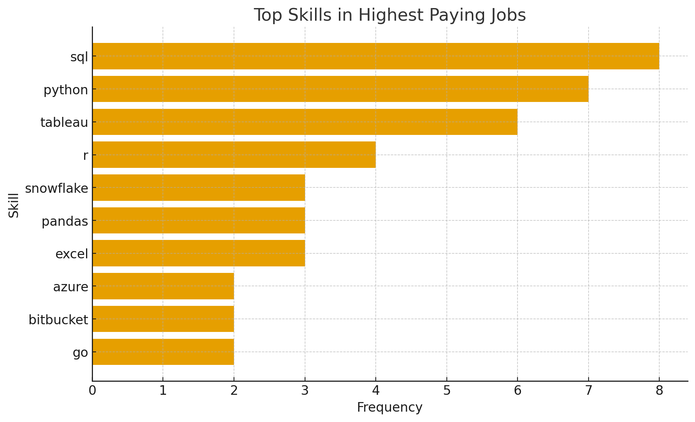
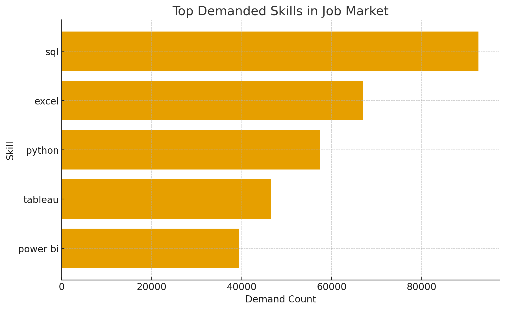
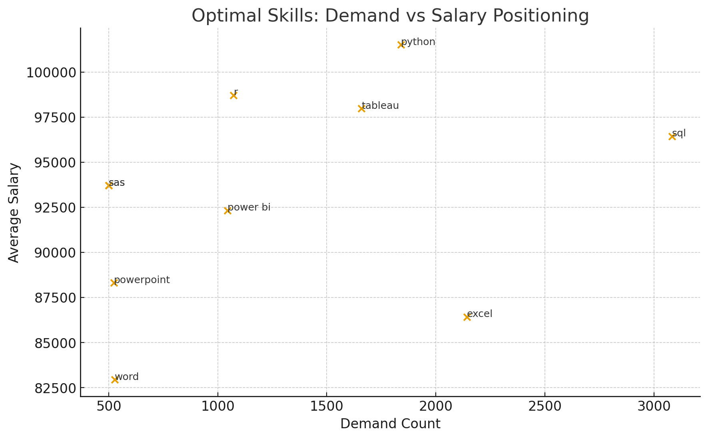
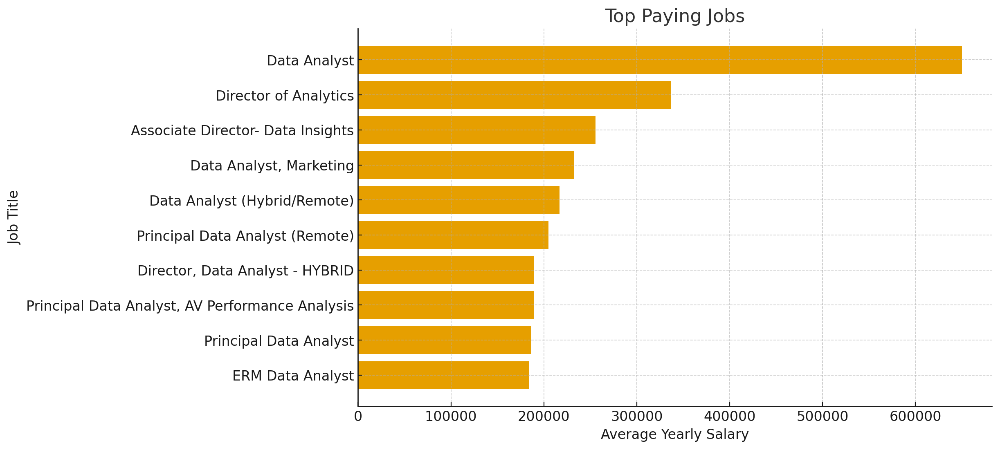

README.md
# Introduction
Welcome to my SQL Portfolio Project, where I delve into the data job market with a focus on data analyst roles. 
This project is a personal exploration into identifying the top-paying jobs, in-demand skills, 
and the intersection of high demand with high salary in the field of data analytics.

Check out my SQL queries here: [project_sql folder](/SQL-Data-Analytics-Portfolio/).

# Background
The motivation behind this project stemmed from my desire to understand the data analyst job market better. I aimed to discover which skills are paid the most and in demand, making my job search more targeted and effective. 

The data for this analysis is from Luke Barousse’s SQL Course. This data includes details on job titles, salaries, locations, and required skills. 

The questions I wanted to answer through my SQL queries were:

1. What are the top-paying data analyst jobs?
2. What skills are required for these top-paying jobs?
3. What skills are most in demand for data analysts?
4. Which skills are associated with higher salaries?
5. What are the most optimal skills to learn for a data analyst looking to maximize job market value?

# Tools I Used
In this project, I utilized a variety of tools to conduct my analysis:

- **SQL** (Structured Query Language): Enabled me to interact with the database, extract insights, and answer my key questions through queries.
- **PostgreSQL**: As the database management system, PostgreSQL allowed me to store, query, and manipulate the job posting data.
- **Visual Studio Code:** This open-source administration and development platform helped me manage the database and execute SQL queries.

# The Analysis
Each query for this project aimed at investigating specific aspects of the data analyst job market. Here’s how I approached each question:

### 1. Top Paying Data Analyst Jobs
To identify the highest-paying roles, I filtered data analyst positions by average yearly salary and location, focusing on remote jobs. This query highlights the high paying opportunities in the field.
```sql
SELECT
    job_id,
    job_title,
    job_location,
    job_schedule_type,
    salary_year_avg,
    job_posted_date,
    name AS company_name
FROM job_postings_fact
LEFT JOIN company_dim ON job_postings_fact.company_id = company_dim.company_id
WHERE
    job_title_short = 'Data Analyst' AND
    job_location = 'Anywhere' AND
    salary_year_avg IS NOT NULL
ORDER BY 
    salary_year_avg DESC
LIMIT 10
```

🔎 Key Findings

One outlier skews the market signal
The $650K Data Analyst role is an extreme compensation spike, not a benchmark. It inflates the mean and shouldn’t drive salary expectations.

Titles don’t map to pay hierarchy
Director-level roles sit around ~$330K, well below the top IC role. In analytics, compensation aligns with scope and specialization—not job titles.

Core salary band is stable and narrow
Most roles cluster between $180K–$260K, indicating a consistent market clearing price for senior data talent across employers.

### 2. Skills for Top Paying Jobs
To understand what skills are required for the top-paying jobs, I joined the job postings with the skills data, providing insights into what employers value for high-compensation roles.
```sql
WITH top_paying_jobs AS(
    SELECT
        job_id,
        job_title,
        salary_year_avg,
        job_posted_date,
        name AS company_name
    FROM job_postings_fact
    LEFT JOIN company_dim ON job_postings_fact.company_id = company_dim.company_id
    WHERE
        job_title_short = 'Data Analyst' AND
        job_location = 'Anywhere' AND
        salary_year_avg IS NOT NULL
    ORDER BY 
        salary_year_avg DESC
    LIMIT 10
)
SELECT 
    top_paying_jobs.*,
    s.skills
FROM top_paying_jobs
INNER JOIN skills_job_dim as sj ON top_paying_jobs.job_id = sj.job_id
INNER JOIN skills_dim as s ON sj.skill_id = s.skill_id
ORDER BY 
    salary_year_avg DESC
```


🔎 Key Findings

Core technical stack dominates demand
SQL and Python show the highest frequency, signaling that employers continue to anchor top-paying analytics roles around foundational data engineering and programming skills.

Visualization and cloud are secondary differentiators
Skills like Tableau and Azure appear less often but still consistently, indicating they function as value-add capabilities rather than primary hiring drivers.

Specialized tools are niche, not mandatory
Platforms such as Snowflake, Databricks, and Bitbucket surface only a few times, suggesting they enhance competitiveness but don’t define access to high-comp roles.

### 3. In-Demand Skills for Data Analysts
This query helped identify the skills most frequently requested in job postings, directing focus to areas with high demand.
```sql
SELECT
    skills,
    COUNT(sj.job_id) aS demand_count
FROM job_postings_fact
INNER JOIN skills_job_dim as sj ON job_postings_fact.job_id = sj.job_id
INNER JOIN skills_dim as s ON sj.skill_id = s.skill_id
WHERE
    job_title_short = 'Data Analyst'
GROUP BY
    skills
ORDER BY
    demand_count DESC
LIMIT 5
```


🔎 Key Findings

Foundational skills dominate market demand
SQL leads by a wide margin, followed by Excel and Python—confirming that employers prioritize core data handling and analysis capabilities over advanced or niche tools.

Visualization skills are critical but not primary drivers
Tableau and Power BI show strong demand, but at materially lower levels than core analytical skills, positioning them as required for communication, not entry.

The market rewards breadth, not specialization
The sharp volume drop-off after the top three indicates that stacking fundamentals delivers more market mobility than chasing tool-specific expertise.

### 4. Skills Based on Salary
Exploring the average salaries associated with different skills revealed which skills are the highest paying.
```sql
SELECT
    skills,
    ROUND(AVG(salary_year_avg),0) AS avg_salary
FROM job_postings_fact
INNER JOIN skills_job_dim as sj ON job_postings_fact.job_id = sj.job_id
INNER JOIN skills_dim as s ON sj.skill_id = s.skill_id
WHERE
    job_title_short = 'Data Analyst'
    AND salary_year_avg IS NOT NULL
GROUP BY
    skills
ORDER BY
   avg_salary DESC
LIMIT 25
```


🔎 Key Findings

Highest salaries are tied to niche, low-supply capabilities
SVN leads at ~$400K, with other top earners (Solidity, Couchbase, Datarobot) reflecting legacy infrastructure, blockchain, and specialized automation—skills with limited talent pools.

Compensation favors rarity over popularity
Unlike broadly demanded skills (SQL, Excel, Python), these high-paying skills don’t appear frequently in the wider market, indicating pay is driven by scarcity, not volume.

Specialized tools unlock outsized upside but narrow roles
Skills like Golang, MXNet, and Terraform command premium salaries but map to tightly defined technical tracks, signaling high reward but low transferability across job families.

### 5. Most Optimal Skills to Learn
Combining insights from demand and salary data, this query aimed to pinpoint skills that are both in high demand and have high salaries, offering a strategic focus for skill development.
```sql
WITH skills_demand AS (
    SELECT
        s.skill_id,
        s.skills,
        COUNT(sj.job_id) aS demand_count
    FROM job_postings_fact
    INNER JOIN skills_job_dim as sj ON job_postings_fact.job_id = sj.job_id
    INNER JOIN skills_dim as s ON sj.skill_id = s.skill_id
    WHERE
        job_title_short = 'Data Analyst'
        AND salary_year_avg IS NOT NULL
    GROUP BY
        s.skill_id
), average_salary AS (
    SELECT
        s.skill_id,
        s.skills,
        ROUND(AVG(salary_year_avg),0) AS avg_salary
    FROM job_postings_fact
    INNER JOIN skills_job_dim as sj ON job_postings_fact.job_id = sj.job_id
    INNER JOIN skills_dim as s ON sj.skill_id = s.skill_id
    WHERE
        job_title_short = 'Data Analyst'
        AND salary_year_avg IS NOT NULL
    GROUP BY
        s.skill_id
)

SELECT
    skills_demand.skill_id,
    skills_demand.skills,
    demand_count,
    avg_salary
FROM 
    skills_demand
INNER JOIN average_salary ON skills_demand.skill_id = average_salary.skill_id
WHERE
    demand_count > 10
ORDER BY
    demand_count DESC,
    avg_salary DESC
LIMIT 25
```


🔎 Key Findings

A small set of skills delivers the best ROI
Python, Tableau, R, and SQL sit in the upper-right quadrant—offering both strong demand and above-market salaries, making them the most efficient upskilling targets.

High demand doesn’t always equal high pay
Excel has the highest volume but materially lower compensation, showing that ubiquity drives accessibility, not premium pricing.

Niche skills offer lift but limited scalability
Power BI, SAS, and PowerPoint provide solid salaries but appear in lower demand ranges, signaling value within specific workflows—not broad market leverage.

# What I Learned
Throughout this project, I honed several key SQL techniques and skills:

- **Complex Query Construction**: Learning to build advanced SQL queries that combine multiple tables and employ functions like **`WITH`** clauses for temporary tables.
- **Data Aggregation**: Utilizing **`GROUP BY`** and aggregate functions like **`COUNT()`** and **`AVG()`** to summarize data effectively.
- **Analytical Thinking**: Developing the ability to translate real-world questions into actionable SQL queries that got insightful answers.
# Conclusion
This project materially strengthened my SQL capabilities and delivered actionable visibility into compensation and demand dynamics within the data analyst talent market. The insights generated establish a clear roadmap for prioritizing upskilling and targeting roles with the highest return on effort. By aligning development with high-demand, high-value competencies, aspiring analysts can differentiate faster and accelerate market readiness. The work reinforces a core operating principle in analytics: sustained relevance requires continuous skill refresh and proactive alignment with emerging industry signals.